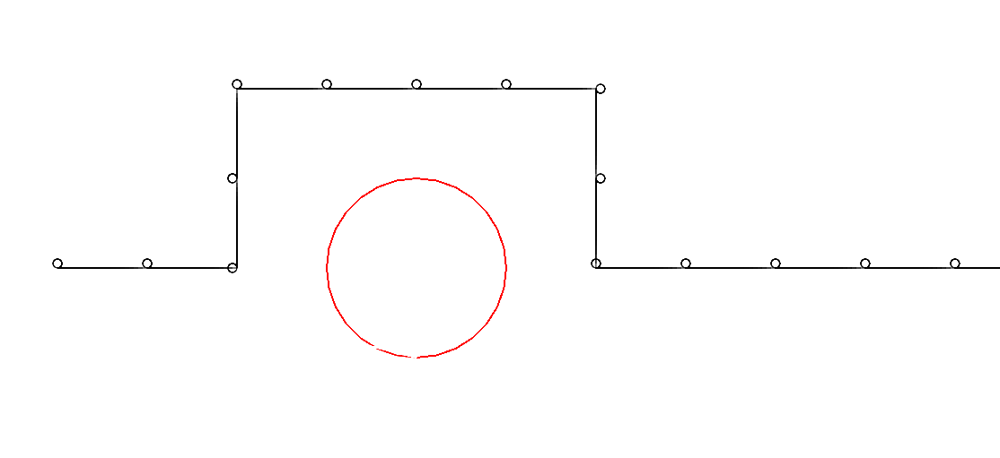
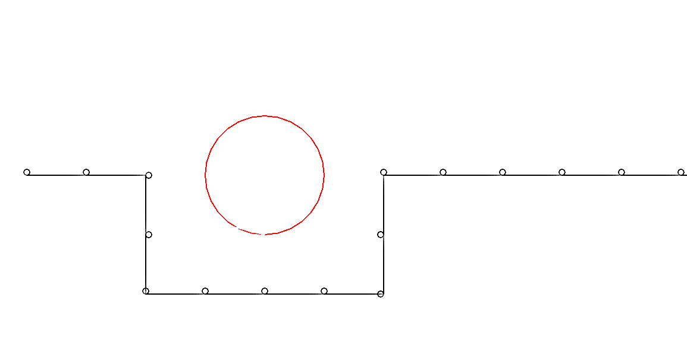

## Порядок выполнения. Условные конструкции

> Конструкция if-else играет важную роль в программировании так как дает возможность выбрать "куда идти" дальше - в зависимости от условия.

---

* Дан код

```python
import turtle as t

# obstacle
t.color("white")
t.setpos(400,-100)
t.color("red")
t.circle(100)
t.color("white")
t.setpos(0,0)

# robot walking
t.color("black")
for steps in range(1,20,1): 
	# ???
  t.circle(5)
  t.forward(100)
  
```

* Запустите его (в той среде где есть Python + turtle) и проверьте как он себя ведет. Предположим это то как шагает ваш "робот" , на его пути препятствие (круглый элемент). В коде эти два участка обозначены комментариями. На данный момент робот проходит сквозь препятствие.
* Требуется добавить код начиная с места отмеченного через **# ???** используя **if** или **if-else** и функции **.left()** , **.right()** так чтобы робот обходил круглое препятствие сверху, а потом модифицировать код так чтобы робот обходил снизу.
* Результаты отображаются ниже

   
   
