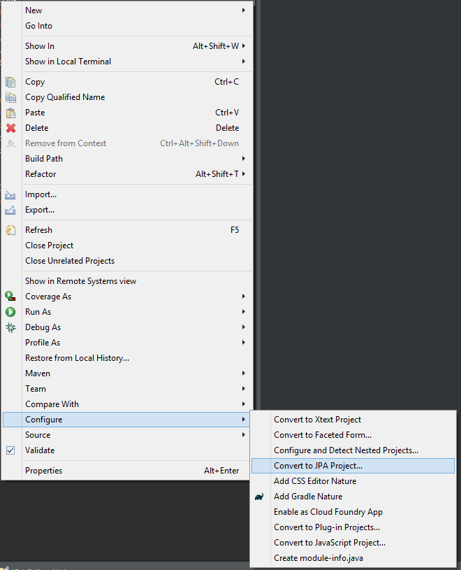
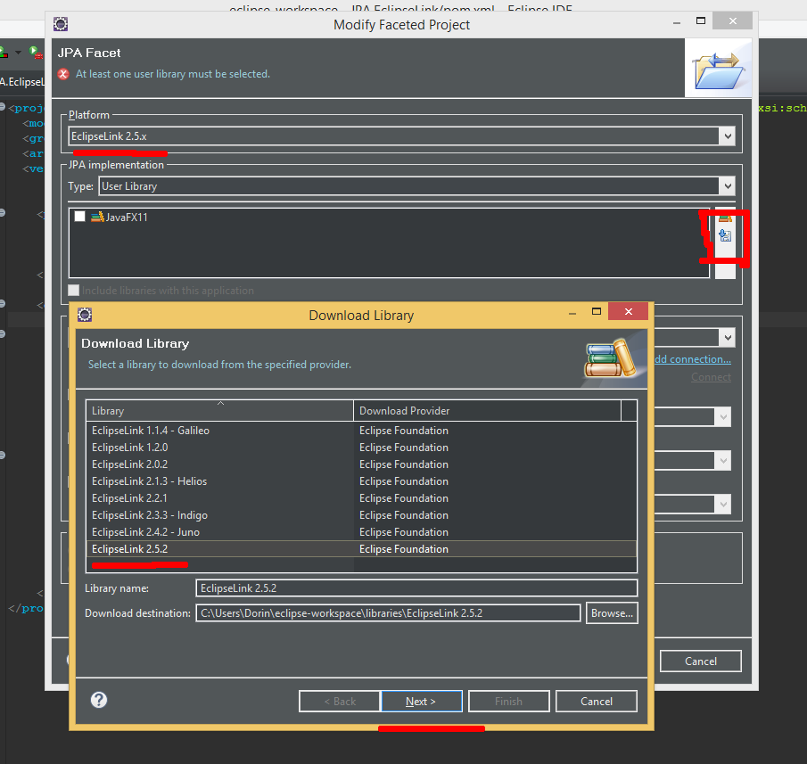

## Имплементирование на уровне JPA используя EclipseLink

> JPA (Java Persistence API) это спецификация Java EE и Java SE, описывающая систему управления сохранением java объектов в таблицы реляционных баз данных в удобном виде. Сама Java не содержит реализации JPA, однако есть существует много реализаций данной спецификации от разных компаний (открытых и нет). Это не единственный способ сохранения java объектов в базы данных (ORM систем), но один из самых популярных в Java мире.

> Сам по себе JPA без реализации сторонней или собственной логики НЕЛЬЗЯ использовать.


* Суть примера создать, настроить и запустить самый простой JPA проект:
  1. Создайте новый "maven Project" с названием группы проекторв "edu.examples" а сам проект назовите "JPA.EclipseLink"
  2. Настройте свойства проекта под JDK 11 и кодировку UTF-8
    ```xml
    <properties>
        <project.build.sourceEncoding>UTF-8</project.build.sourceEncoding>
        <maven.compiler.source>11</maven.compiler.source>
        <maven.compiler.target>11</maven.compiler.target>
    </properties>
    
    ```
  3. При помощи maven установите коннектор SQLite и реализацию JPA - EclipseLink

    ```xml
    <dependencies>
        <!-- https://mvnrepository.com/artifact/org.xerial/sqlite-jdbc -->
        <dependency>
		    <groupId>org.xerial</groupId>
		    <artifactId>sqlite-jdbc</artifactId>
		    <version>3.28.0</version>
		</dependency>
        <!-- https://mvnrepository.com/artifact/org.eclipse.persistence/org.eclipse.persistence.jpa -->
		<dependency>
		    <groupId>org.eclipse.persistence</groupId>
		    <artifactId>org.eclipse.persistence.jpa</artifactId>
		    <version>2.7.5</version>
		</dependency>
    </dependencies>
    ```
  3. Для того чтобы сам IDE Еclipse принял ваш проект как "родной" JPA - проект, клик правый на него и "Configure > Convert to JPA" 
  4. В процессе настройки Eclipse IDE попросит предоставить драйвер для подключения к DB чтобы некоторые опции среды разработки (напр - автогенератор кода классов или таблиц) были доступны
  5. Выбите EclipseLink 2.5.x и дайте Eclipse задание скачать его и установить, почему два раза скачивается EclipseLink? один используется в реализации кода проекта, второй самим Eclipse IDE как родной драйвер для DB / JPA 
  6. Создайте пакет "entities" внутри которого распологаем класс Student, для того чтобы его JPA воспринял как "сущность" добавляем соответствующие аннотации (JPA по умолчанию требует поле Id)
    ```java
        package entities;

        import javax.persistence.Entity;
        import javax.persistence.GeneratedValue;
        import javax.persistence.GenerationType;
        import javax.persistence.Id;

        @Entity
        public class Student {
            @Id
            @GeneratedValue(strategy=GenerationType.AUTO)
            private Long id;
            private String  fullName;
        }

    ```
   
  8. Если все нормально прошло в "src/main/java/META-INF" должен был появится файл "persistence.xml", если его нет, его можно создать вручную с таким кодом
    ```xml
    <?xml version="1.0" encoding="UTF-8"?>
    <persistence version="2.1" xmlns="http://xmlns.jcp.org/xml/ns/persistence" xmlns:xsi="http://www.w3.org/2001/XMLSchema-instance" xsi:schemaLocation="http://xmlns.jcp.org/xml/ns/persistence http://xmlns.jcp.org/xml/ns/persistence/persistence_2_1.xsd">

        <persistence-unit name="sqlite-database">
            <provider>org.eclipse.persistence.jpa.PersistenceProvider</provider>
            <class>entities.Student</class>
            <properties>
                <property name="javax.persistence.jdbc.driver" value="org.sqlite.JDBC" />
                <property name="javax.persistence.jdbc.url" value="jdbc:sqlite:university.db" />
            </properties>
        </persistence-unit>

    </persistence>
    ```
    Это файл настроек для JPA, каждый "persistence-unit" это настройка како-то соединения с каким-то хранилищем (name - идентификация соединения). "provider" - уточняет драйвер JPA (реализацию) - полный путь до класс драйвера. "class" - уточняет учавствующие сущности в этой базе данных. "properties" - свойства соединения, тут мы указываем для SQLITE лишь диалект и путь до базы - так как SQLITE не требует больше спецификаций. ГДЕ найти примеры конфигов? - например [тут](https://gist.github.com/aleroddepaz/f5c0870a61160e6559f26b950d762301) а так же их много можно нагуглить или даже в док-ах соответствующих драйверов (EclipseLink,TopLink,Hibernate...)
  9. Создает пакет "main" с классом Application
     ```java
        package main;

        import javax.persistence.EntityManager;
        import javax.persistence.EntityManagerFactory;
        import javax.persistence.Persistence;

        public class Application {
            public static void main(String[] args) {
                check();
            }
            
            public static void check() {
                EntityManagerFactory factory = Persistence.createEntityManagerFactory("sqlite-database");
                EntityManager em = factory.createEntityManager();
            }
        }

     ```  
     в методе "check()" мы всего лишь делаем проверку "связи" с DB. JPA использует концепцию Factory / Repository. В этих 2 строках кода мы на основе конфига ```<persistence-unit name="sqlite-database">``` создаем "фабрику" сущностей. А из нее получаем менеджера сущностей. При выполнении такого кода, работая с SQLite ваша программа попытается найти, либо создать файл "university.db". 
 10. Проверьте если программа запустилась без ошибок и если у вас сформировался файл базы данных SQLITE.    