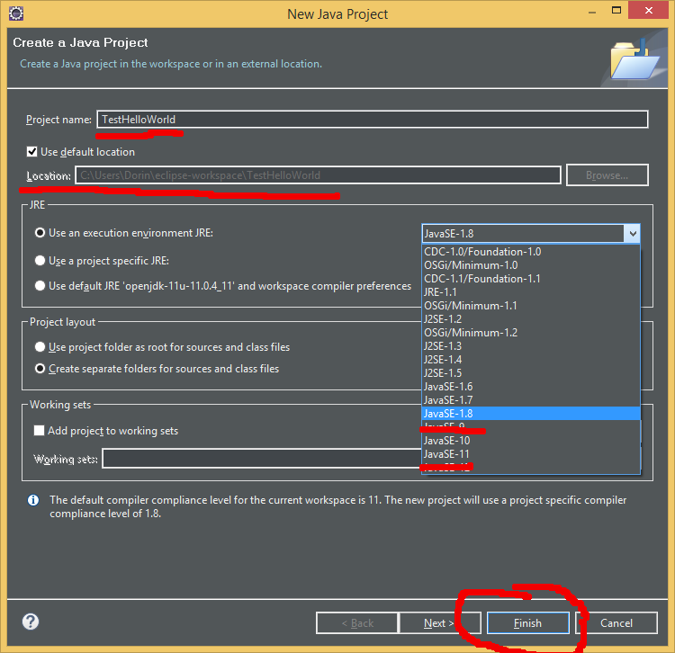
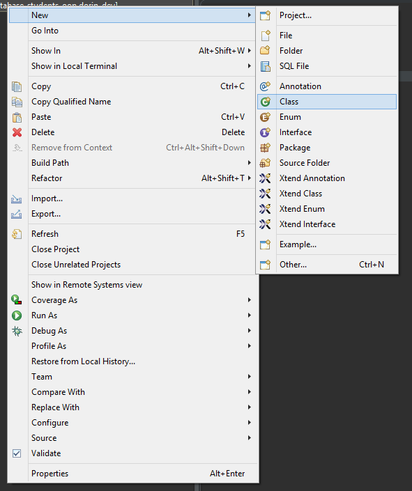
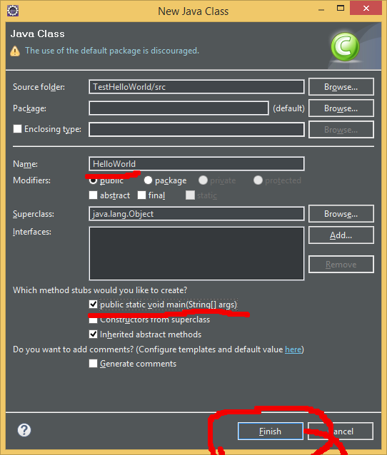
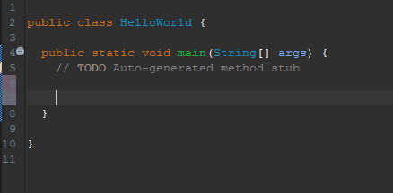

## Установка и настройка среды разработки под "eclipse" и Java 11

1. Во-первых установите себе JDK (Java Development Kit) Вы можете выбрать несколько источникох (поставщиков  JDK но будьте внимательны насчет лицензий и того как вы собираетесь использовать то что скачиваете!):
   1. [Oracle JDK](https://www.oracle.com/technetwork/java/javase/downloads/index.html) 
   2. [Open JDK](https://jdk.java.net/archive/) 
   3. [Open JDK](https://adoptopenjdk.net/index.html?variant=openjdk11&jvmVariant=hotspot)

2. И в случае если вы устанавливаете JDK из архива "вручную" и в случае авто-установщика убедитесь в том что вы запомнили "папку" куда попал ваш JDK
3. После, рекомендую перезагрузить ПК, особенно если это Windows OS
4. Для установки IDE (Integrated Development Environment) - простыми словами для начинающего - редактора кода (и не только), Eclipse заходим [сюда](https://www.eclipse.org/downloads/) и скачиваем установщик или в ручную [сюда](https://www.eclipse.org/downloads/packages/) и выбираем "Eclipse for Java ..." или "Eclipse for Enterprise Java ..."
5. В процессе установки многие IDE попытаются "найти" путь до той папки где находится Java (JDK), если этого не произойдет, убедитесь в том что после установки JDK в ваших системных или пользовательских переменных среды ОС есть такая запись как "JAVA_HOME" с адресом той папки где находится JDK
6. После проверки, запускаем "Eclipse"
7. При первом запуске вас попросят выбрать "путь/папку" куда Eclipse будет сохранять все ваши проекты, обычно такая папка условно называется "WORKSPACE" создайте у себя такую папку и выберите ее
8. После открытия среды разработки, чтобы создать/протестировать самый простой проект (приложение) поступите так:
   1. File > New > Java Project
   2. Выберите для него имя, например "TestHelloWorld"
   3. Убедитесь в том что workspace правильно указан
   4. Выберите версию Java платформы (JDK) в которой все будет компилиться/запускаться 
   5. И Finish
    
9. У вас теперь есть проект! но его не достаточно. В самом проекте необходимо создать запускаемый "файл" для того чтобы можно было хоть что-то увидеть на экране. (Для вас проект - как обертка вокруг "ядра" который содержит запускаемый код )   
10. Создаем это "ядро" следующим образом:
    1.  Клик правый на свой проект (его папка должна высветится в левой стороне от редактора)
          
    2.  New > Class
    3.  Вбиваем имя класcа "HelloWorld" !!! И отмечаем галочкой "public static void main()"
          
    4. На все остальное пока не обращаем внимание! и жмем "Finish"     
    5. В редакторе откроется файл "HelloWorld.java" с классом "HelloWorld" и той функцией "main()" внутри которой пока что будем работать не выходя за ее рамки
11. В том месте которое отмечено на картинке (то есть в "теле" блока "main()") пишем следующие инструкции
    ```java
    System.out.println("Hello World!");
    System.out.println("Application launched successfully!");
    ```            
    

12. Для компиляции / запуска приложения нажмите F11, если все прошло удачно в "консоли" вывода вы увидите те 2 сообщения      