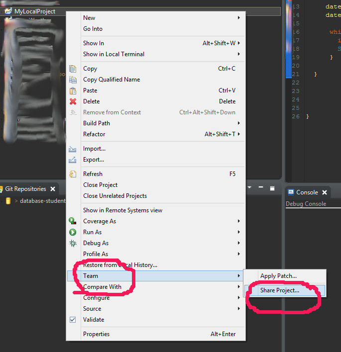
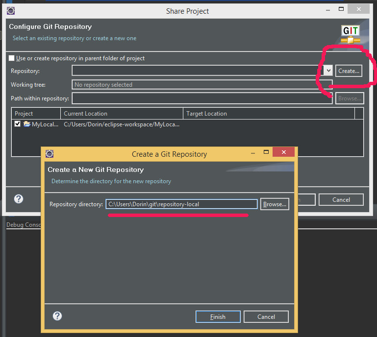
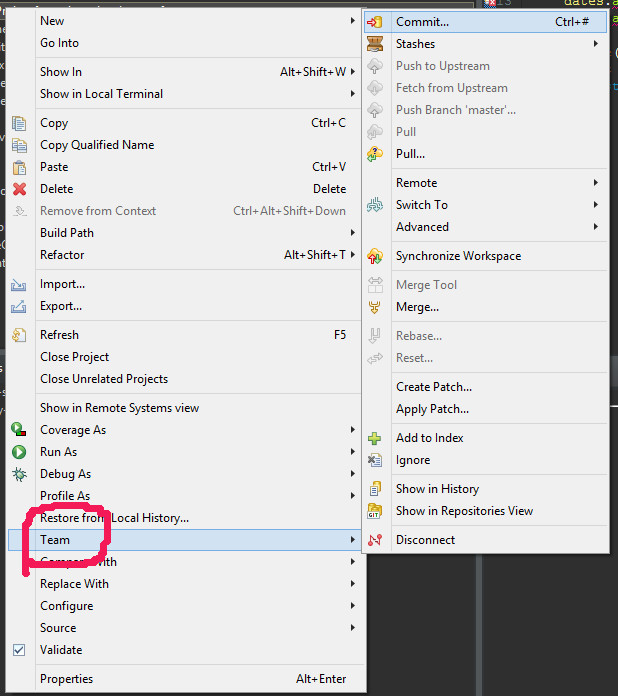
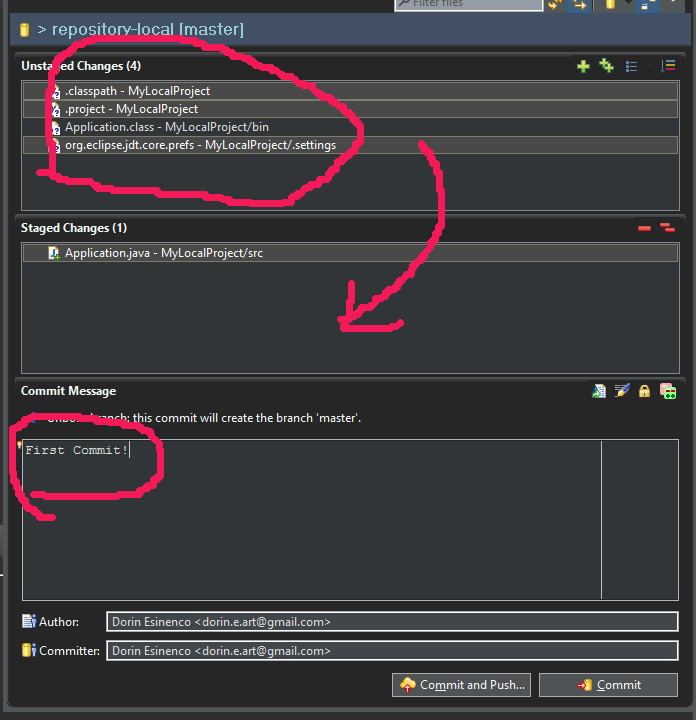
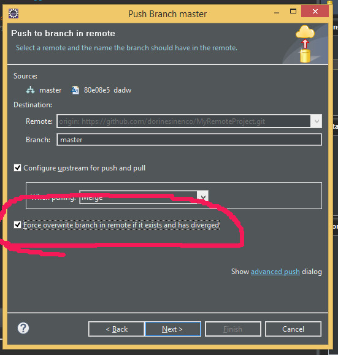

# Как запушить новый локальный репо
1. Создаем репозиторий на github.com и копируем его ссылку (ту что используется для CLONE)
2. В панели проектов, правый клик на папку нашего локального проекта, "Team > Share" 
  
   .

3. Жмем "Create" (так как наш новый проект не воспринимается еще как git репозиторий) указываем путь до локальной репозитории 
   
   
   
   FINISH!

4. В панели проектов, правый клик на папку нашего локального проекта, "Team > Share", теперь мы видим набор опций, так как наш проект привязан к репозипории (локальной), делаем первый "commit" 
  
  

  
  

  так же с верхнего окна "перетягиваем" в низ только те папки и файлы что нужно залить на git. Обычно такие файлы как .classpath, .project, .class-файлы - их не заливают, так как это настройки вашей среды разработки! Иногда даже опасно их залить - дабы не выдать какие-то пароли/ключи

  

  В окне с сообщениями пишем инфу - зачем мы делаем этот commit, дабы "закрепить" первые изменения, под конец жмем "Commit and Push"

  

5. В окне что вылезло теоретически Eclipse должен был сам вставить ссылку с буфера обмена (пункт 1) на удаленный репозиторий, если нет, то вручную комплектуем поля в окне  
   
   

    NEXT

    указываем "ветку" в которую будет пушить (обычно для начинающего - master)

   

   "Force ovewrite" - поможет начинающему избежать ошибок нестыковки состояния веток. Там же "When pulling - Merge" - простое решение когда нестыкуются изменения.

6. Далее каждый раз после редактирования локальных файлов, при желании выложить обновления в git Клик правый на проект - "Team > Share" и по тем же стопам!