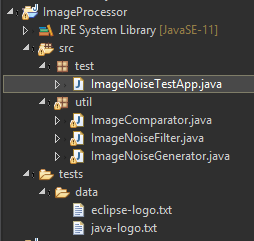

## Обработка текстовых файлов в символьном режиме

* Данный пример показывает простой вариант обработки изображений в виде текста благодаря концепции ["ASCII Art"](https://ru.wikipedia.org/wiki/ASCII-%D0%B3%D1%80%D0%B0%D1%84%D0%B8%D0%BA%D0%B0)

---

* Вам предстоит написать простой алгоритм очистки текстовых изображений от "шума". Алгоритм который вы напишите необходимо будет протестировать. Для того чтобы вам было легче понять как устранить шум, посмотрите сначала на то как он добавляется, для этого:

* Скачайте код из [этой папки](./code) и создайте на его основе проект соблюдая структуру папок что на изображение ниже




* В **src** находяться два пакета: "test" - где код запускающий тесты, "util" - утилиты для обработки "изображений". 
* Сами картинки (логотипы 2-х технологий) находятся в оригинальном варианте в "tests/data/*.txt" (eclipse и java) 
* Перед тем как начать работу, посмотрите в главный класс ```ImageNoiseTestApp``` на методы что вызываются в **main()**: заметьте что идет подготовка теста **testsSetup()** потом запускается сам тест **testNoiseReduction()**
* Подготовка теста состоит в том что при помощи метода **.applyNoiseTo( ... )**, поверх оригинальных картинок, применяется "шум" с разными концентрациями (25,50,75) в процентном соотношении. При этом генерируются новые текстовые файлы в той же папки где и оригинал. Откройте и посмотрите оригинал и файлы с шумом.

Например логотип JAVA в чистом виде выглядит так

```
                                               ,                                
                                               *#(                              
                                               ###,                             
                                              .###/                             
                                             /####.                             
                                           ######,                              
                                       *#######(                                
                                    #########,      *##*                        
                                 (########/    ,####,                           
                               (#######*    #####*                              
                              ######(    (#####                                 
                             ######     #####(                                  
                             ######    *#####(                                  
                              #####/    #######                                 
                               #####     #######(                               
                                .####     /######.                              
                                  .###      (####                               
                                     /#     (##(            ,*****.             
                  ,********,               (#*              .********           
                 **********,,,...........,,,,**********,         *****          
                   ,****************************/,              ,*****          
                          .*                                   ******           
                       *****,.           .,*********,       ******              
                        **************************/*.    ****.                  
                                                                                
                         *****,.             ,***.                              
                         ****************************                           
              *********       .//************/,                 *.              
           ******                                          ,******              
            **************************************************    .**           
                  .,*/*************************//*.         .******             
                      *****************************************                 

```

а после добавления шума (25%) выглядит так

```
 x      x   x  xx  x     x  x  x        xx  x  , x  xx   x  x  x     x  xx      
xxxx x  x x       xx     x    x   x  x x       *#(       x         xx x         
  x  x   x x x     x   xxx         x x         ###,    x               xxx      
       x             x          x          x  .###/    x   x        x x         
  x  x   x x  x    x   x        x x  x  x    /####.  xx       x  x x xx x    x  
     xx   x          x xxx  x xx x         ######,       x  x           xx   x  
      x         xx xx   x    xx  xx    *#######( xx x   xx   xx   x x   x  xx x 
          xx x       x    x     x  x#########,     x*##* x    xxxx              
        xx     x xx   x        x (########/  x ,####,     x   xx           x  xx
    xxx                   xx   (#######* xx #####*  x       x   x            x  
 x    x   x    x              ######(    (#####x    xx x x x x xxx    x   x    x
   x   x   xx  x x  xxx   x  ###### x   #####(  x  x  x       x   x    xx     x 
 x      xxxx  xx  x        xx###### x x*#####(               x  x   x        x  
      x    x  x           x   #####/  x #######      x      x         x      xxx
 x      xxx        x           ##### x  x#######(  x    x    x x  x x x         
  xx       x   x     x      x  x.#### x  x/######.         x   xx x   xx x      
  xx   xxx   xx    x x x   x  xx x.###x x   (####xxx   x xx  xx x        x   x  
       xxx   x  xx     xx       xxx  /# x   (##(  xxx     x ,*****. x  x   x xx 
 x  x xx  x       ,********,  x        xx  (#*      x       .********x   x  x   
 x    xx xxxx    **********,,,...........,,,,**********,  x x    ***** xx     x 
 x xx x            ,****************************/,  x x         ,*****x x  xx   
xx       x     x  x  x x  .* x x   x         x  x  x  xx   x   ******  x        
  x                    *****,.        x  .,*********,    x  ******x x  x        
   x    x  xxxx    xx  x**************************/*.xx x****. x xxxx x   xx   x
     x x    xx x x   x  x        xxxx     xxx   x   x                 x   x     
  x                x     *****,. x           ,***.      x   x xx       x  xx x x
 x xx x       x      xxx **************************** xx   xx x  x x         xx 
  x  xx   x x *********       .//************/,    xx x x  x    *.   x x x    xx
     x x  x****** x xx   x      x     x     xx     x  x xxx,******   x x    x   
 x     x   x**************************************************    .**    x   x  
 x     x          .,*/*************************//*.      x  .******       x x x 
 x x      x   xx   x  *****************************************   x          x x

```

можно увидеть что шум добавлен за счет рандомного распределения символа "x" в пустое пространство картинки.

* Посмотрите на алгоритм метода **.applyNoiseTo( ... )** и попытайтесь его понять.

---

ТРЕБУЕТСЯ:
  1. Добавить код для метода **.removeNoiseFrom( ... )** то чтобы он очистил переданную картинку от шума и сохранил ее с суффиксом ".clean.txt".
  2. Добавить код для метода **.compareTwo( ... )** так чтобы он открыл два файла картинок, сравнил бы их символ за символом, и вернул бы целое кол-во отличающихся символов. Если файлы совпадают, метод возвращает - 0
  3. Разкомментировать в тесте вызов методов очистки и проверки картинок так чтобы при запуске теста результат был

```

########################################
SETTING UP TESTS
########################################
########################################
TESTS RUNNING
########################################
TEST SUCCEEDED!

```


  4. Подумать как можно оптимизировать код метода ** .testNoiseReduction(...) ** так чтобы его стало меньше!