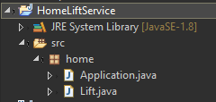

## Классы. Статика и инкапсуляция, модификаторы доступа

> Java package (пакет Java) — механизм, позволяющий организовать Java классы в пространстве имен аналогично модулям в языке программирования Модула. Обычно в пакеты объединяют классы одной и той же категории, либо предоставляющие сходную функциональность.

> ВНИМАНИЕ! С выходом JDK 9 в языке Java появилась новая возможность - модульность. Модульность позволяет разбить код на отдельные структурные единицы - модули. Фактически модуль представляет группу пакетов или ресурсов, объединенных в одно целое и к которым можно обращаться по имени модуля.

> До Java 9 было несколько уровней инкапсуляции функционала. Первый уровень представлял класс, в котором мы могли определить переменные и методы с различным уровнем доступа. Следующий уровень представлял пакет, который, в свою очередь, представлял коллекцию классов. Однако со временем этих уровней оказалось недостаточно. И модуль стал следующим уровнем инкапсуляции, который объединял несколько пакетов.

> Модуль состоит из группы пакетов. Также модуль включает список все пакетов, которые входят в модуль, и список всех модулей, от которых зависит данный модуль. Дополнительно (но необязательно) он может включать файлы ресурсов или файлы нативных библиотек.

> Модификаторы доступа — ключевые слова, которые Вы добавляете при инициализации для изменения доступа. Язык Java имеет следующий список модификаторов доступа: public, protected, private.

---

* Предположим мы должны продумать логику (софт) который обслуживает лифт в жилом доме с 10-ю этажами и парковкой в подвале, а так же с террасой на крыше. Софт состоит из двух частей:
  * клиентская сторона (класс Application c **main()** ) - та что ближе к "потребителю"
  * сервисная сторона (класс Lift) - что сто скрыто должно быть от пользователя
* Весь софт - отдельный Java Project с структурой как на рисунке
   

* Обратите внимание! мы создали пакет с именем "home"
* В "Application" есть только метод "main()" который может обращаться к методам класса "Lift"!!!

* Добавим в класс лифт несколько статических свойств:

  ```java
    package home;

    public class Lift {
        // Lift's memory
        final static double MAX_WEIGHT = 1000.0; // kg
        final static byte MAX_LEVEL = 11;
        final static byte MIN_LEVEL = 0;
        static boolean isOperational = true;
        static boolean isMoving = false;
        static boolean isClosed = true;
        static byte level = 0;
        static double weight = 0;


        // Lift's actions
        // ...
    }
* Начинающему рекомендуется воспринимать свойства класса как переменные и константы которые содержатся прямо в классе и доступны ВСЕМ МЕТОДАМ класса (многие называют их - глобальными). Т.е. для этих "переменных" капсулой служит сам класс.  
* КОНСТАНТЫ используются чтобы установить первичный уровень защиты от "возможных" изменений значения, этот уровень защиты ближе всего находится к самому значению. 
* В нашем примере мы (поставщики логики ЛИФТА) решаем что защищать и что нет. Например если не зафиксировать максимальный вес - то его случайно / специально могут увеличить и тогда это может привести даже к катастрофам.
* Есть еще такое золотое правило проектирования софта в схеме "producer-consumer" - поставщик всегда должен предоставлять логику которая "умнее" логики потребителя, или поставщик должен облегчать логику потребителя забирая часть задач под себя!
* В нашем классе **Lift** мы установили следующие свойства (можно считать это память лифта!):
  * **MAX_WEIGHT** - макс допустимый вес в кг (вес груза!) в кг
  * **isOperational** - исправен ли ЛИФТ
  * **isMoving** - в движении ли ЛИФТ
  * **isClosed** - закрыты ли двери лифта
  * **level** - уровень (этаж) где находится лифт на данный момент
  * **weight** - сколько весит лифт на данный момент (вес груза)
  
* Теперь подумаем - если оставить данные свойства без модификатора доступа, они будут доступны нашему приложению **Application** находящемуся в том же пакете **home**. Это означает что в методе **main()** в любой момент "потребитель" сможет установить любое значение свойствам класса  (например - этаж 100: ```Lift.level = 100;```) и тогда наш лифт не сможет правильно себя вести в здании с 10-ю этажами. Или еще хуже, когда в лифте много пассажиров на самом деле - установить ```Lift.weight = 0;``` и тогда он будет работать даже при 10+ пассажирах. 
* Зачем создавать "капсулу" защищающую логику Лифта? - чтобы меньше ответственности нести за то КАК им будут пользоваться.
* Давайте применим капсулу по всем свойствам что являются меняемыми извне, добавим "private" перед всеми:
  ```java
    private static boolean isOperational = true;
    private static boolean isMoving = false;
    private static boolean isClosed = true;
    private static byte level = 0;
    private static double weight = 0;

  ```
  - Как вы думаете, почему мы не добавили "private" перед константами?
  - теперь - единственные кто могут менять их значения - это методы класса **Lift**, так как **private** дает доступ только внутри текущего класса. 
  - контрольный вопрос: - могли бы мы защитить эти значения используя "final" ? аргументируйте

* Теперь зададим себе вопрос - ведь у нормального лифта - потребитель должен "ВИДЕТЬ" номер этажа где находится лифт, если попробовать в **main()** такой код:
    ```java
    System.out.println(Lift.level);
    ``` 
    вы получите отказ в доступе - так как **level** - уже private, как же быть? в таких ситуациях создают то что называется "геттером" - метод специализирующий себя в "получении" значения определенного защищенного свойства. Добавим геттер для "level" в класс **Lift**
    ```java
    public static byte getLevel(){
      return level;
    }
    ```
    как вы видите он просто вернет значение данного свойства (находясь в том же классе и имея модификатор **public** - его можно вызвать из вне!),обратите внимание на то КАК назван метод и какой тип он вернет обратно!.

    !!! Для свойства "level" мы специально дали только возможность его "прочитать" из вне, но его строго запрещено изменять вне класса лифта. Так как "потребитель" не должен иметь право назначать текущий уровень.

    теперь в любой момент из **main()** мы можем запустить код
    ```java
    System.out.println(Lift.getLevel());
    ``` 

* Следуя примеру, добавьте геттеры следующим свойствам:
   - isOperational
   - isMoving
   - isClosed
  другим свойствам не даем доступ извне так как это бесполезная информация для потребителя. 
  ВНИМАНИЕ - для геттеров **boolean** типа обычно названия дают такие же как и самим свойствам - напр. ```boolean isOperational()```

* Добавим "сеттер" ```setLevel(int)``` - метод специализирующаяся в установлении значения **level**. Но мы его сделаем приватным!   

    ```java
    private static void setLevel(int level){
       if( level < MIN_LEVEL || level > MAX_LEVEL ){
         System.err.println("Level value out of bounds!");
         return;
       }
       Lift.level = (byte)level;
    }
    ```
    обратите внимание на:
     - как назван метод
     - как обращаются к свойству (во избежания конфликта с аргументом c таким же именем - **level**)
     - если переданное значение не соответствует - мы выводим ошибку и выходим из метода (Да да! **return** без значения!) что не даст ему дойти до назначения нового значения свойству **level**

* То есть "сеттер" - метод для установки значения - не даст нам случайно установить не то значение, почему private? потому что установка значения текущего этажа - должна подчинятся логики лифта (ну где вы видели чтобы пассажир установил сам то на каком этаже лифт?)

* Добавить сеттер для "isMoving", он должен дать возможность установить true - только если масса груза не выше нормы
---
* Добавим метод для вывода на экран "карты лифта". Это публичный метод так как его "видит" потребитель (житель дома).  
  ```java
  public static void printLiftMap(){
    // ???
  }
  ``` 
  Используя уловные и повторяющие конструкции - напишите логику метода **printLiftMap()** так чтобы результат выглядел как на диаграмме
  ```
   T |       |
  10 |       |
   9 |       |
   8 |       |
   7 |       |
   6 |       |
   5 |  ] [  | 
   4 |   v   |
   3 |       |
   2 |       |
   1 |       |
   P |       |
  ```
  это ситуация для лифта тогда когда он на 5-ом этаже, двигается вниз и двери "] [" закрыты (для открытых дверей используйте "[]" а для неисправного лифта - "]x[" - isOperational==false).


* Создадим метод для открытия дверей
  ```java
  public static boolean openDoors(){
    // ???
  }
  ``` 
  Этот метод должен работать ТОЛЬКО если лифт исправлен (isOperational) и если он не в движении (isMoving)!
  напишите логику метода таким образом чтобы метод установил в **isClosed** значение **false**
  и вернул **true** только если двери открылись (то есть внешний мир - сможет увидеть через return true/false если лифт открывает двери или нет).
  Смысл тут в том чтобы не открывать двери пассажирам если лифт в не исправности или в движение!
  
* Создадим метод для закрытия дверей
  ```java
  public static boolean closeDoors(){
    // ???
  }
  ``` 
  Этот метод должен работать ТОЛЬКО если лифт исправлен (isOperational) и если он не в движении (isMoving) и если нету перегруза!
  напишите логику метода таким образом чтобы метод установил в **isClosed** значение **true**
  и вернул **true** только если двери закрылись (то есть внешний мир - сможет увидеть через return true/false если лифт закрыл двери или нет).
  Смысл тут в том чтобы не закрывать двери пассажирам если лифт или в не исправности или в движение или слишком тяжелый чтобы начать двигаться!
  
* Предположим каждый раз когда заходит очередной пассажир, мы каким-то сенсорным путем получаем его вес и прибавляем к общему весу груза
  ```java
  public static void enterPassenger(double passengerWeight){
    // ???
  }
  ``` 

* Предположим каждый раз когда выходит очередной пассажир, мы каким-то сенсорным путем получаем его вес и отнимаем из общего веса груза его вес
  ```java
  public static void exitPassenger(double passengerWeight){
    // ???
  }
  ``` 


* Предположим двигатель лифта построен так что ему можно давать с софта команду подняться или спустится только на один уровень и все (тоесть для того чтобы поднять лифт на 3 уровня выше - придется 3 раза вызвать команду "подними на один уровень выше"). Добавим метод, это скрытый метод - дает подъем на 1 уровень.
  ```java
  private static boolean moveOneLevelUp(){
    level++;
    // ???
    return true;
  }
  ``` 
  допишите логику так чтобы лифт не вылетел из здания. Этот метод вернет **true** только если удается еще один шаг выше сделать, если лифт уже на последнем уровне - вернет **false**

* По аналогии добавить метод который спускает лифт на 1 уровень ниже
  ```java
  private static boolean moveOneLevelDown(){
    level--;
    // ???
    return true;
  }
  ```    
* ВНИМАНИЕ - пока вы пишите логику для лифта - пытайтесь разделить все методы на 2 категории: низкого уровня логику и высокого уровня!

* Добавим вспомогательный метод который сравнит текущую позицию лифта с той которую ему передают
  ```java
  private static int compareLevel(int level){
    return true;
  }
  ``` 
  обратите внимание! он возвращает **int** - вот почему:
    - метод вернет 0 - если лифт уже на указанном уровне
    - метод вернет 1 - если лифт выше указанного уровня
    - метод вернет -1 - если лифт ниже указанного уровня
  
  метод приватный - так как он требуется для внутренних схем логики лифта

* Теперь добавим более "умные" методы которые решат куда лифту идти
  ```java
  public static boolean moveToLevel(int level){
    // ???
    return true;
  }
  ```
  данный метод - должен определить где лифт (выше он, ниже или на том же этаже - используйте метод - **compareLevel()** ) по отношению к тому месту куда его просят "идти" - аргумент **level**,  и пользуясь циклом и условными выражениями (так же методами **moveOneLevelUp()**, **moveOneLevelDown()** ) довести лифт до указанного этажа! ПРИ ЭТОМ КАЖДЫЙ ШАГ должен сопровождаться выводом карты лифта - **printLiftMap()**

  данный метод не должен запускаться если:
    - Двери не закрыты
    - Перегруз
    - Лифт не исправлен
    - Лифт уже на том же этаже
  
  Например если лифт на 3-eм а его просят попасть на 8-й, то он должен 5 раз повторить **moveOneLevelUp()**.
  обратите внимание что данный метод должен вернуть **true** если он начал двигаться / удалось сдвинуться

--- 
### Работаем с клиентской логикой в **main()**

## сценарий 1 - два пассажира, нормальный вес груза с этажа (0) - парковка - поднимаемся на верх до 3-го
```java
Lift.printLiftMap();
Lift.openDoors();
Lift.enterPassenger(80); // kg
Lift.enterPassenger(100); // kg
Lift.closeDoors();
Lift.moveToLevel(3);
Lift.printLiftMap();
```
Мы должны при этом увидеть на экране 

  ```
   T |       |
  10 |       |
   9 |       |
   8 |       |
   7 |       |
   6 |       |
   5 |       | 
   4 |       |
   3 |       |
   2 |       |
   1 |       |
   P |  ] [  |
  ```
  ```
   T |       |
  10 |       |
   9 |       |
   8 |       |
   7 |       |
   6 |       |
   5 |       | 
   4 |       |
   3 |       |
   2 |   ^   |
   1 |  ] [  |
   P |       |
  ```
  ```
   T |       |
  10 |       |
   9 |       |
   8 |       |
   7 |       |
   6 |       |
   5 |       | 
   4 |       |
   3 |   ^   |
   2 |  ] [  |
   1 |       |
   P |       |
  ```
  ```
   T |       |
  10 |       |
   9 |       |
   8 |       |
   7 |       |
   6 |       |
   5 |       | 
   4 |       |
   3 |  ] [  |
   2 |       |
   1 |       |
   P |       |
  ```

## сценарий 2 - перегруз
```java
Lift.printLiftMap();
Lift.openDoors();
for(int i=0;i<11;i++) {
  Lift.enterPassenger(100); // kg
}
if( Lift.closeDoors() ) {
  System.out.println("PASSENGERS: The doors are closing");
} else {
  System.err.println("PASSENGERS: The doors are not closing!");
};
if( Lift.moveToLevel(3) ){
  System.out.println("PASSENGERS: The lift started moving");
} else {
  System.out.println("PASSENGERS: The lift is not moving!");
};
Lift.printLiftMap();
```

### Продолжайте тестить логику лифта разными другими ситуациями - на свое усмотрение, так чтобы улучшить качество софта!