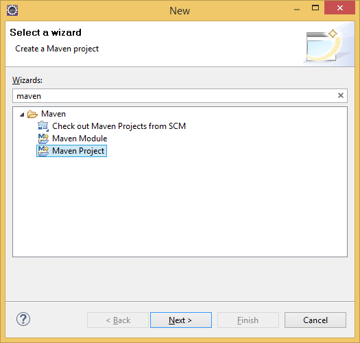
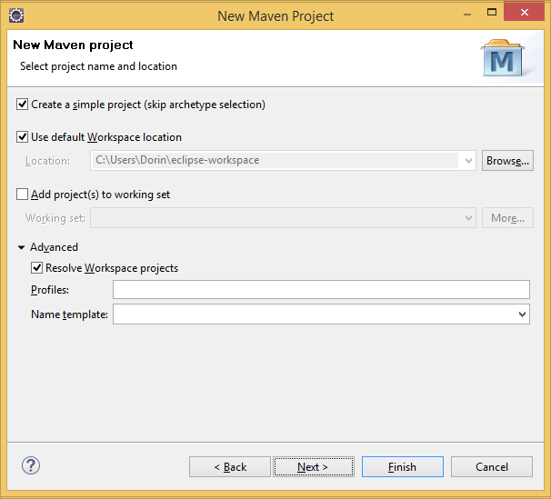
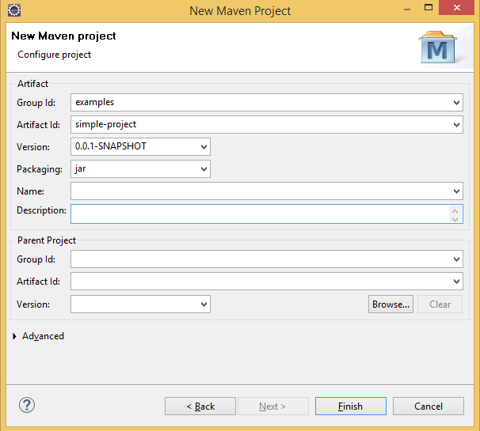
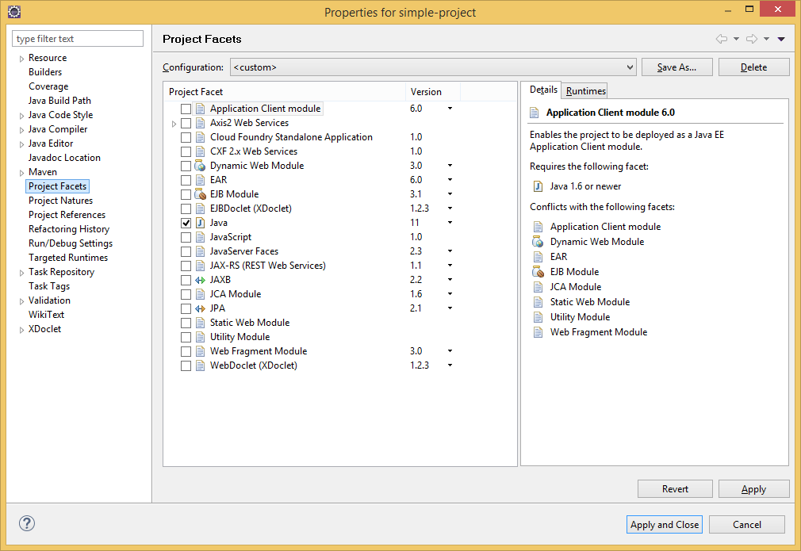
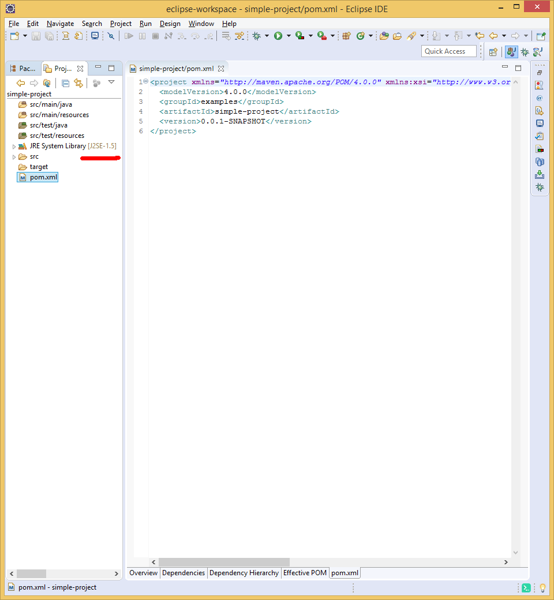
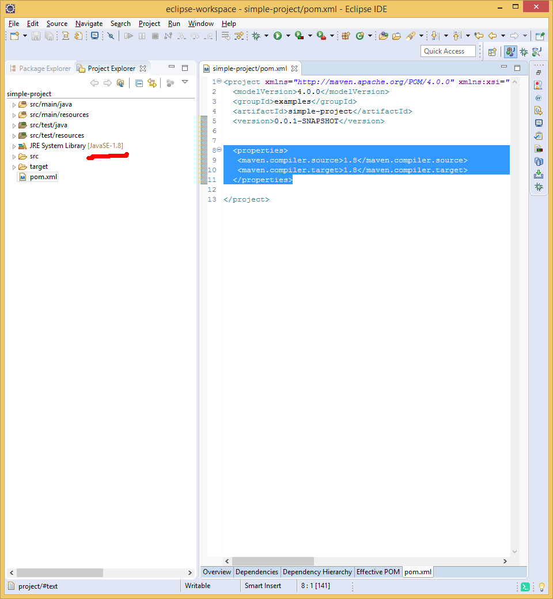
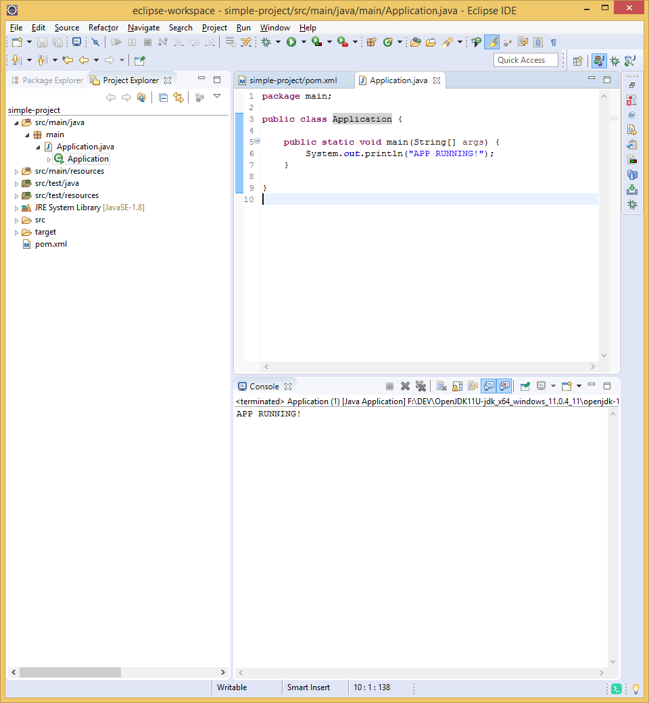

### чтобы в eclipse создать maven проект следуем инструкциям

1. заходим в "Window > Preferences > Java > Installed JRE's" и проверяем чтобы хотяб один JDK был в списке и чтобы его минимальная версия была равна или больше того что требует maven pom.xml
2. Если нет - скачиваем JDK / OPENJDK желательно минимум 1.8 (Java 8) и добавляем путь до папки через кнопку на рисунки - при этом путь должен указывать на тот уровень папок в котором находится "bin", "lib", итд самого JDK. Зачем это надо ведь в эклипс код и так компилится?  - На забудем с какой целью используется maven - Для сборки, а некоторые этапы сборки требуют доступа к среде разработки.


3. Далее создаем новый "maven project": "File > New > Other" пишем "maven" выбираем "maven project"


4. Для упрощения начнем с простого шаблона проекта потому выбираем "Create a simple project (skip archetype skeleton)"


5. Даем имя групе к которой относится проект (group id) "examples" потом самому проекту (artifact id) оставляем стартовую версию 0.0.1 и выбираем упаковку "jar". Что такое "jar" - на выходе MAVEN по умолчанию проект будет упакован в специальный архив вместе с ресурсами и метаданными - чтобы получить дистрибютив.
 -> FINISH


6. Пройдя эти шаги у вас появится проект с минимальной рабочей структурой для MAVEN, но скорей свего "eclipse" не будет видеть ваш проект как "Java Project". Чем вы рискуете - в таком случае - тем что все что касается синтаксиса, валидации кода, запуска приложения и компиляции будет невозможно сделать из eclipse. Как проверить? - в Project Explorer/Package Explorer проверьте если Eclipse видит ссылку на JRE System Library а во вторых папка "src" должна быть отмечена значком "package". Если нету этого следуйте 7-му пункту

7. Клик правый на проект "Properties > Project Facets" выбираем - "Java", применить! (Кстати таким методом можно и в других ситуациях и видах проекта - преобразовать проект из одного типа - в другой)
 -> Apply

8. Если вы получили примерно такую структуру как на картинке ниже, проверьте версию Java которую прописал eclipse/maven по умолчанию, если 1.5 то поменяем мы это вот как. 
 -> Apply

Добавим  секцию со свойствами в **project** уточная версию java compiler и JRE (для jdk 9+ пишем без "1." )
```xml
  <properties>
   <maven.compiler.source>1.8</maven.compiler.source>
   <maven.compiler.target>1.8</maven.compiler.target>
  </properties>
```  
!!! после нажимаем правым на проект и "Maven > Update Project", проверяем "Project Explorer" указанная версия должна там быть


9. Создаем в "src" новый package "main" и класс "Application", запускаем обычным F11/Run проверяем если IDE может запустить наше Java приложение (maven тут нипричем!) 
 -> Apply

10. "Научим" maven собирать нам упаковку с JAR-om а так же перед этим научим его запускать приложение чтобы мы увидели если все работает. Для этого добавляем 

```xml
  <build>
  	<plugins>
  		<plugin>
  			<groupId>org.apache.maven.plugins</groupId>
  			<artifactId>maven-shade-plugin</artifactId>
  			<version>3.2.1</version>
  		</plugin>
  	</plugins>
  </build>
```
в секцию "project" с таким плагином (у maven есть очень много плагинов которые являются builders - тоесть могут проводить сборку)
11. Правый на проект - "Maven > Update Project" (рекомендуется так делать когда мы вносим изменения в конфиг pom.xml)
12. Правый "Run As > Maven Build" даем имя новому BUILD - например "package" и запускаем, выглядеть должно как на картинке, а в папке "target" должем появится JAR - дистрибютива вашего приложения !!!


