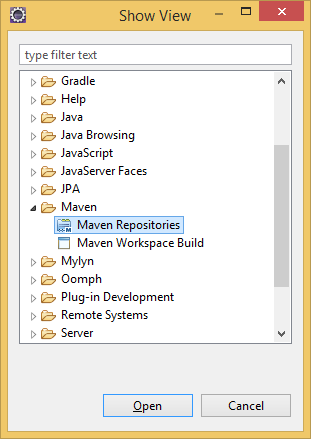
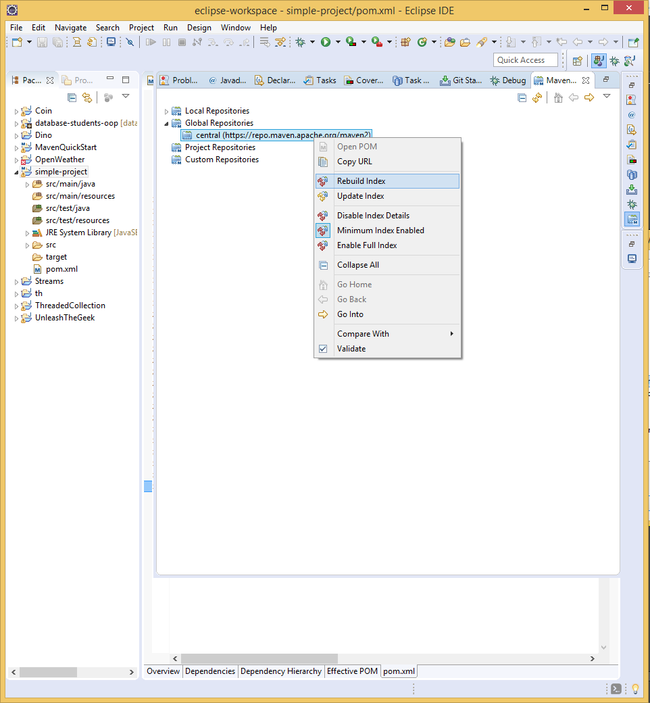
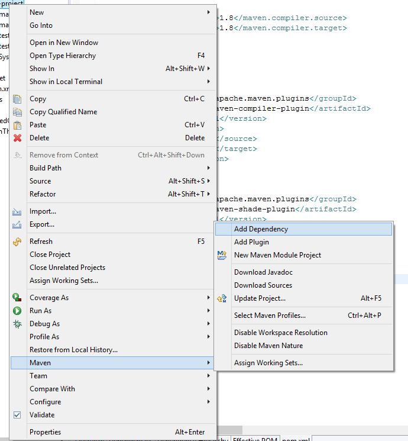
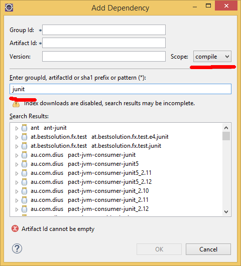
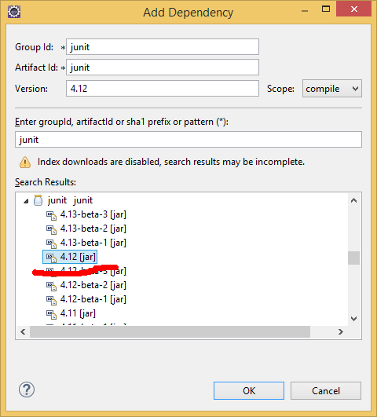
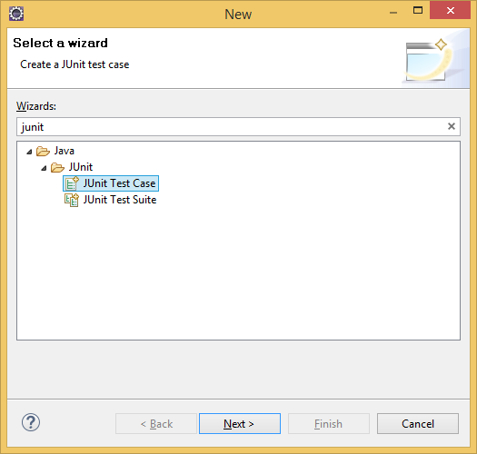
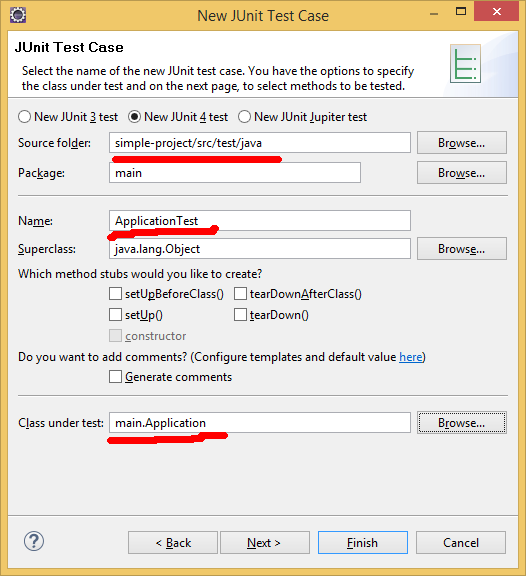
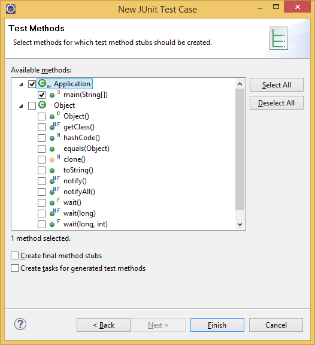
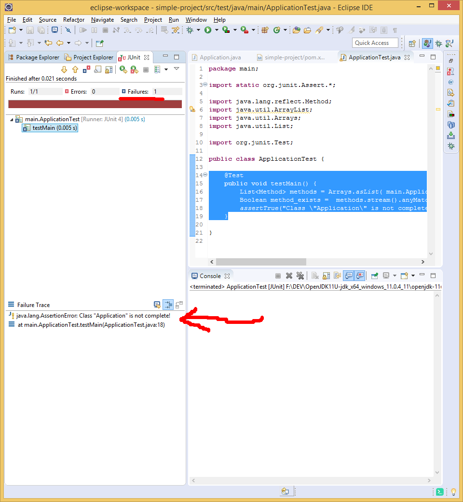
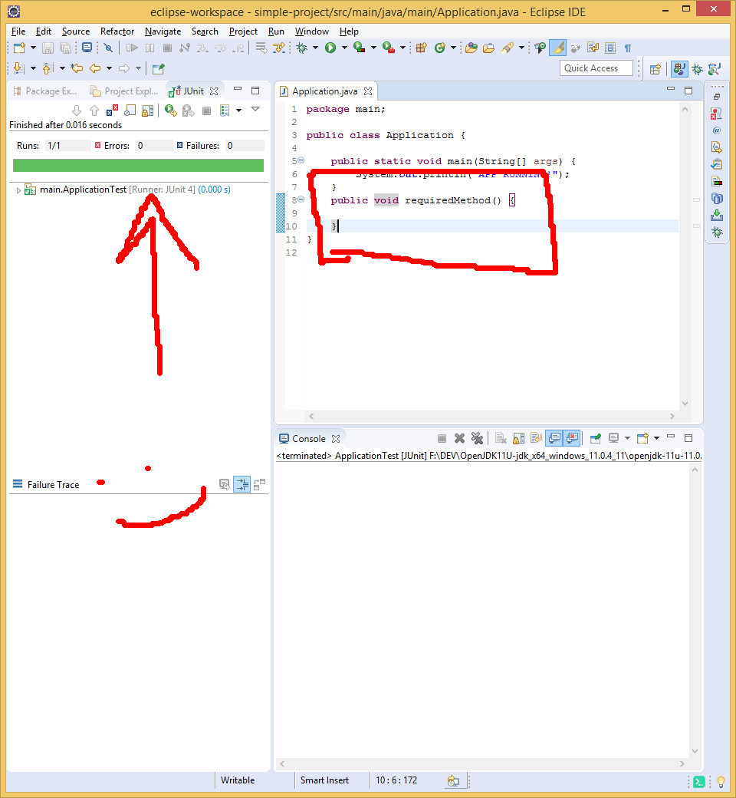

### Работа с "junit" в maven

> JUnit библиотека для модульного тестирования программного обеспечения на языке Java.
> В нашем примере мы будем тестировать наш основной класс "Application" на наличие метода с именем "requiredMethod". Почему это важно? иногда при "апгрейде логики", до ее публикации в разные модули или приложения, требуется проверить наличие определенных методов. Или на оборот - например для новой версии нашего публикуемого пакета некий метод был объявлен как устаревший (deprecated) и система должна убедится в том что его удалили из класса.


* Во-первых нам следует установить 2 mvn пакета "junit" и "faker" чтобы можно было генерировать данные и проводить автотесты. Когда мы работаем в eclipse у нас 3 варианта как минимум - как установить пакеты:
  1. зайти на сайт репозиторий mvnrepository.com, найти нужное и скопировать в секцию **dependencies** в "pom.xml"
  2. Скачать индекс пакетов с maven и искать в самом eclipse
  3. В командной строке (terminal) но при этом "maven" должен быть установлен как независимая программа 

* В данном примере будем использовать метод 2. Для этого зайдите в "Window > Show View > Other" выберите в секции "Maven > Maven Repositories"
     
    потом правый на "Global Repositories" и "Rebuild Index"
     
    ВНИМАНИЕ! - этот процесс может долго длится но его делают редко. При этом вы получаете локальный список пакетов и их зависимостей с "maven repositories". Чтобы увидеть если процесс еще идет - следите за окном eclipse в правом нижнем углу будет статус (rebuilding index.... 0%)

1. Чтобы установить **junit** в проект, мы можем зайти вручную на mnvrepository.com найти и кинуть ссылку в pom.xml, а так же можем сжедать правой на проект "maven > Add Dependency"
   
   вбиваем ключевое слово в поиск и выбираем режим "test"
   
   так как нам добавлять "junit" в готовый пакет не нужно, зато необходимо добавить его в процесс "testing"-а нашего проекта.
   Выбираем последнюю стабильную версию
   

2. Октройте "pom.xml" обратите внимание что в секцию "dependencies" появилась запись зависимости что вы выбрали с ```<scope>test</scope> это говорит о том что maven будет пользоваться этой библиотекой только в процессе (фазе) тестирования
3. Далее, убедитесь в том что у вас в "src/test/java" есть хотяб один "package" если нет создайте package "main". Это не обязательно, но хорошая практика называть пакеты тестов так же как и пакеты тех классов что мы тестируем. Сам тест добавим через клик правый на проект "New > Other > Junit" и выбираем "Junit Test Case"
    
   Это значит что мы создаем некую "ситуацию" дла того чтобы проверить поведение нашего софта в такой ситуации.
   Далее, внимательно заполняем 3 поля:
   * Source Folder - проверьте чтобы был в папке "src/test"
   * Дайте имя новому тесту обычно ИмяКлассаЧтоМыТестируемTest - в нашем случае ApplicationTest
   * ниже выбираем сам класс ( или пишем путь до него ) что мы будем тестировать "main.Application"
    NEXT
4. В следующем экране он предложит сгенерить методы теста для каждого метода вашего класса, обычно называются "testИмяМетода()' выбираем "Applicaion -> main" и FINISH
   

5. Посмотрите на новый класс ApplicationTest над методом стоит аннотация @Test - это говорит о том что результат ниже лежащего метода определяет результат одного теста (их может быть множество)
    ```java
    	@Test
            public void testMain() {
                fail("Not yet implemented");
            }
    ```
6. На данный момент из-за вызова метода **fail()** когда запустится тест JUnit - система будет считать что именно данный тест - провален с сообщением "Not yet implemented". Клик правый на проект "Run As > Maven test" - проверьте так оно?
   ПРИМЕЧАНИЕ, не обязательно каждый раз тест запускать через maven (это обычно делается уже перед самой сборкой пакета) на данный момент у вас есть опция "Run As > JUnit test" что переключит вас в "perspective JUnit" и в таком режиме вы рулите тесты даже без maven, попробуйте.
   В такой перспективе F11/Run будет по умолчанию запускать именно JUnit тестирование пока вы не переключитесь в "perspective Java" обратно.

7. Если вы помните изначально было предложенно создать тест который проверит есть ли у нашего главного класса метод "requiredMethod". На данный момент его нет что хорошо. Переделайте код тест сценария на следующий:
    ```java
    	@Test
            public void testMain() {
                List<Method> methods = Arrays.asList( main.Application.class.getMethods() );
                Boolean method_exists =  methods
                                         .stream()
                                         .anyMatch(method -> { 
                                             return method.getName().equals("requiredMethod"); 
                                         }  );
                assertTrue("Class \"Application\" is not complete!", method_exists);
            }
    ```    
    что будет наш метод теста делать?
    1. Обратится к классу Application и получит массив с объектами всех его методов!! да да! именно объекты методов. Что это значит? В Java есть пакет посвещенный работе с классами и структурами самих классов, называется это тема "Java Reflection". Иными словами Java может "сам себя изучить изнутри", или Java код для инспекции "Java кода" )).
    2. К сожалению .getMethods() возвращает массив, с массивом неудобно работать потому преобразуем его в список
    3. Список преобразуем в поток .stream() и в потоке обработки используем метод .anyMatch()
    4. .anyMatch() требует Предикат который вернет ему true/false в зависимости от условия что нам требуется, если перевести дословно "any match" - хотябы одно совпадение, этот метод вернет нам true - если хотябы одно значение в потоке вернет true
    5. В самом условие я сравниваю имя метода класса Application с "requiredMethod"
    6. Последняя строка в testMain(), **assertTrue()** это один из методов JUnit который предпологает что переданное второе значение как аргумент должно быть правдой, в ином случаем тест "фэйлится" с сообщением что переданно как первый параметр

8. Запустите тест занового после добавления данной логики, он должен не проходить

    

9. Добавьте требуемый метод в класс "Application" (не забудем что мы тестируем только присутствие метода, не его параметры, не его тип возврата, даже static или его отсутствие на данный тест не повлияет ...)  
       

---
#### После успешного выполнения трейнинга попробуйте решить задание
* Добавить новый тест (метод) в тот же класс "ApplicationTest" с названием "testAnotherMethod()" его суть в том что он даст правду (пройдет тест) только при 3-х условиях:
  1.  Наличие метода "anotherMethod()" в классе "Application"
  2.  Тип возврата (return type) метода "boolean"
  3.  Он получает первый параметр с типом "String"