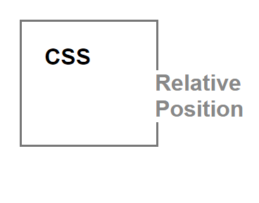

## positionarea relativa in CSS

* Permite deplasarea libera a elementului fata de pozitia sa initiala, respectand fluxul de elemente.

* Utilizand drept baza [index.html](./index.html) incercati sa completati in felul urmatorul locurile marcate in cod cu "???":
  1. Raspundeti la intrebarea - de ce in acest loc  s-a indicat regimul "inline-block", si cu ce este egala latimea si inaltimea blocului **h1.brand** din start? (din punct de vedere logic). Ce reprezinta unitatea de masura **em**?
  2. Cum se aranjeaza din start elementele **span** ? in rand sau nu? Ce proprietate trebuie sa scrieti in locul marcat cu acest numar ca elementele date sa nu se mai aranjeze in rand?
  3. Completati locul marcat cu "???" astfel incat sa ajungeti la rezultatul de mai jos

      