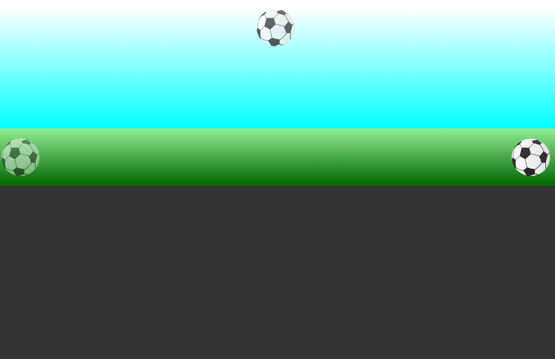

## Selectorii in CSS. Selectorii descendentilor (mostenitorilor)

> Atunci cand este nevoie sa accesati un element (niste elemente) care vor contine cateva clase simultan, selectorul se va scrie "lipind" denumirile claselor intre ele, gen - ```.clasa-1.clasa-2.clasa-3 { ... }```, in asa mod nu sunt afectate alte elemente care au doar unele dintre aceste clase 


* Urmatorul fragment de cod [index](./index.html) reprezinta in 3 "stari" ale mingei pe un teren de fotbal. 
* Se cere sa:
  * In comentarii CSS raspundeti la intrebarile:
    1. Ce inseamna selectorul ```.ball.onField.left { ... } ``` si prin ce difera de ```.ball { ... }```? 
    2. Completati codul utilizand ```float``` si ```margin``` pentru alinierea pe orizontala a mingii!
    3. Completati codul CSS ca sa obtineri urmatorul rezultat 
          

