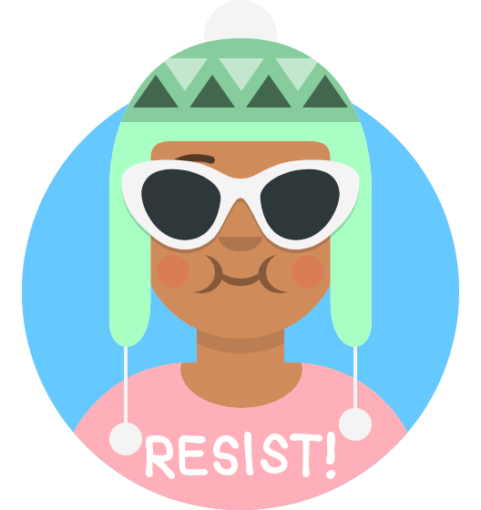
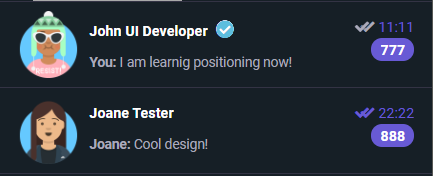

## Оформление списка контактов чата

> Оформляя это сегмент макета, обратим особое внимание на то как правильно именовать классыБ применяя методологию "БЭМ", подробнее [тут](https://ru.bem.info/methodology/css/)

---

* Несколько простых правил:
  1. Имя класса состоящее из 2 и более слов - разделяем "-" - например **top-menu** или **left-column**
  2. Имя класса передающую модификацию (другое состояние, вариант) - разделяем "--" - например **top-menu--dark** или **left-column--closed**
  3. Имя класса передающую иерархию (елемент внутри другого) - разделяем "__" - например **top-menu__link** или **left-column__heading**


---

1. Вставьте в ```<div class="chat-contacts"></div>``` следующий фрагмент кода. Это список контактов на основе элемента ```<ol></ol>``` где каждый элемент это один контакт (один пользователь).

```html
        <ol class="chat-contacts__list">

            <li class="chat-contacts__contact">
                <div class="chat-contacts__preview">
                    
                    <div class="chat-contacts__message">
                        <h3>John UI Developer <i class="fas fa-check-circle"></i></h3>
                        <p><b>You:</b> I am learnig positioning now!</p>
                    </div>
                </div>
                
                <div class="chat-contacts__timestamp">
                    <div class="chat-contacts__status--unread">
                        <i class="fas fa-check"></i><i class="fas fa-check"></i>
                        <time datetime="11:11">11:11</time>
                    </div>
                    <span class="chat-contacts__counter">
                        777
                    </span>
                </div>

            </li>


            <li>
                contact 2 ... repeat
            </li>

            <li>
                contact 3 ... repeat
            </li>

            <li>
                contact n ... repeat
            </li>
        </ol>    

```
2. Аватары можно бесплатно сгенерировать [тут](https://getavataaars.com/) 
3. Посмотрите внимательно на то как названы классы элементов в списке контактов. Для них применена технология BEM. Проверьте свои знания:
   1. Объясните почему списку дали класс **chat-contacts__list** ?
   2. В чем суть названия класса **chat-contacts__status--unread** ?
4. Продолжим, в "[viber.css](./css/viber.css)" добавим следующие селектора, обратите внимание что конда используется BEМ, так как сами классы были названы довольно таки четко и ясно, нет смысла создавать слишком сложные вложенные селектора!

```css

.chat-contacts__contact{
 
}

.chat-contacts__contact:first-child{
    
}

.chat-contacts__message .fa-check-circle{
  
}

.chat-contacts__preview{
   
}

.chat-contacts__preview h3{
   
}

.chat-contacts__preview p{
   
}

.chat-contacts__preview p b{
  
}

.chat-contacts__avatar{
  
}

.chat-contacts__timestamp{
  
}

.chat-contacts__status--unread{
  
}

.chat-contacts__status--read{
   
}

.chat-contacts__status--unread .fa-check,
.chat-contacts__status--read .fa-check{
 
}

.chat-contacts__status--unread .fa-check:first-child{
  
}

.chat-contacts__status--unread time{
  
}

.chat-contacts__counter{
  
}


```

5. Дополните код CSS в селекторах так чтобы результат выглядел примерно так в натуральном размере. Для начала сверстайте один контакт, потом добавьте еще несколько с вариациями! Рекомендуемый набор единиц измерения "px", "em", "%". Используйте "float", "text-align", "position", "margin", "padding" для расположения элементов внутри каждого контакта. А так же не забудьте один важный момент, то что родительский элемент (при вычислении в режиме "auto" высоты) будет "плохо" реагировать на дочерние "float" или "position absolute"!
    
    Вот вам результат в масштабе для большей ясности
    [result-contact x 2](./result-contactx2.png)

6. После того как сверстали 1 контакт, посмотрите на результат, в левой стороне НАМЕРЕННО есть недостаток с точки зрения UI/UX, найдите его и исправьте!

БОНУС 1 - добавьте стиль который "слегка" заменит цвет того контакта на который мы наводим

БОНУС 2 - в названиях классов статуса сообщения где применяются модификаторы "unread" и "read" есть нарушение при использовании этих 2-х классов по отношению к правилу применения модификаторов BEM - найдите, исправьте!

---
[ссылка на всю папку](./)

