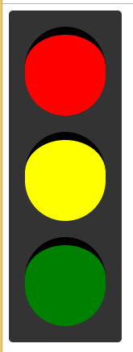

## Lucrul cu modelul CSS Box.
### Semafor


> Cand lucrati cu o boxa in CSS nu uitati cele mai importante aspecte ale acesteia:
>   1. directiile: top, right, bottom, left
>   2. dimensiunile: width, height
>   3. spatiile: padding, margin si border


* ATENTIE la selectorii compusi!
---
* in baza [index.html](./index.html) sa se completeze stilurile marcate cu ```/* ??? */``` astfel incat sa se obtina urmatorul rezultat
  