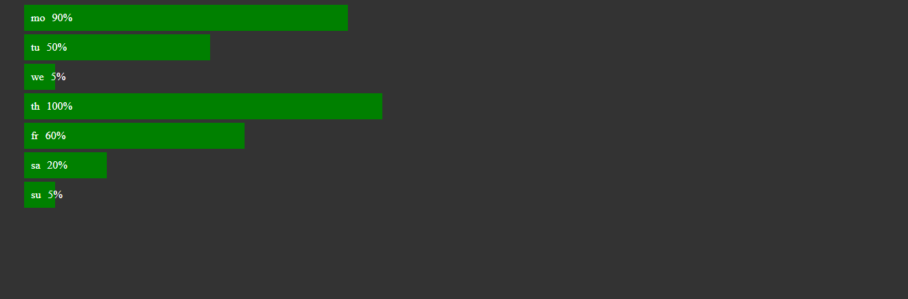

### Lucrul cu modelul boxa

* Imaginati-va ca [html](index.html) in containerul "div" cu identificatorul "graph" este desenat un grafic cu ajutorul listei ul/li care reprezinta fluctuatiile temperaturilor pentru intreaga saptamana

---
* Cu ajutorul CSS (background-color,width,padding,margin,list-style,color) faceti in asa mod incat rezultatul sa fie 
