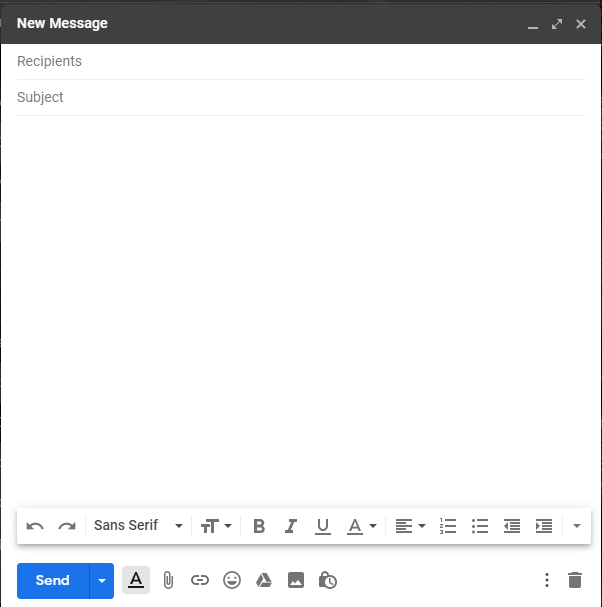

# Formulare in html

* In baza imaginii de mai jos
 
  

  sa se macheteze formularul asemanator cu cel utilizat pentru a compune un mesaj nou in mesageria "gmail"
  Pictogramele (iconitele) le putem downloada si utiliza in formatul PNG sau SVG de [aici](https://material.io/resources/icons/?style=baseline)

--- 

Ca antrenament, incercati sa raspundeti la intrebarea - care este diferenta intre formatele de imagini PNG si SVG,care ar fi avantajele si neajunsurile acestora