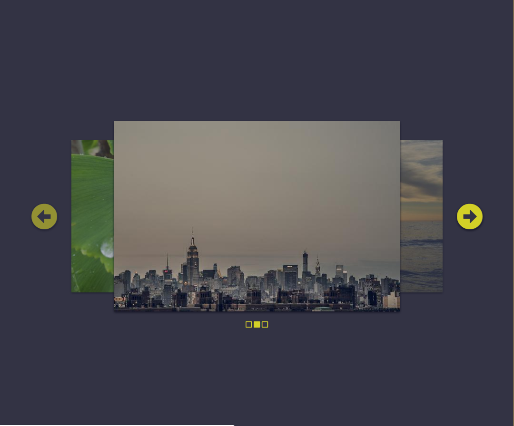
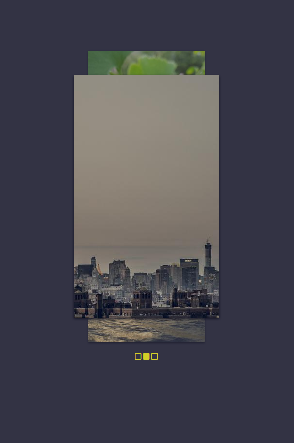

### Адаптивные макеты! Использование медиа запросов CSS


* Скачайте [папку с стартовым кодом](./) 
* Обратите внимение на структуру HTML, особенно на элементы ```<picture>``` и ```<source>``` правило которое написано в media="..." загрузит другие картинки для размеров экрана когда ширина меньше или равно 1000px
* Необходимо дополнить код таким образом чтобы макет выглядел:
  1. На большом экране так (>1000px) 
    
  2. На маленьком экране так (<=1000px) 
    
 

