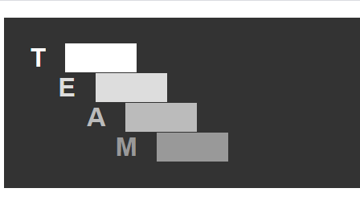
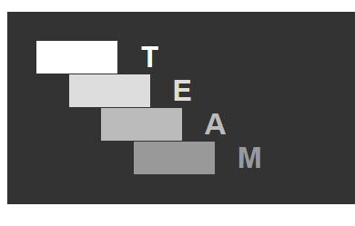

# Работа с типографией

* В CSS есть 4 единицы измерения тесно связанные с размером шрифта: em,rem,ch,ex

---

* на основе [index](./index.html) используя:
  * margin, margin-xxxx
  * color
  * border,border-xxxx

  сделайте так чтобы результат выглядел как на следующем изображение
      

  а потом переделайте селекторы и стили так чтобы результат выглядел как тут
   