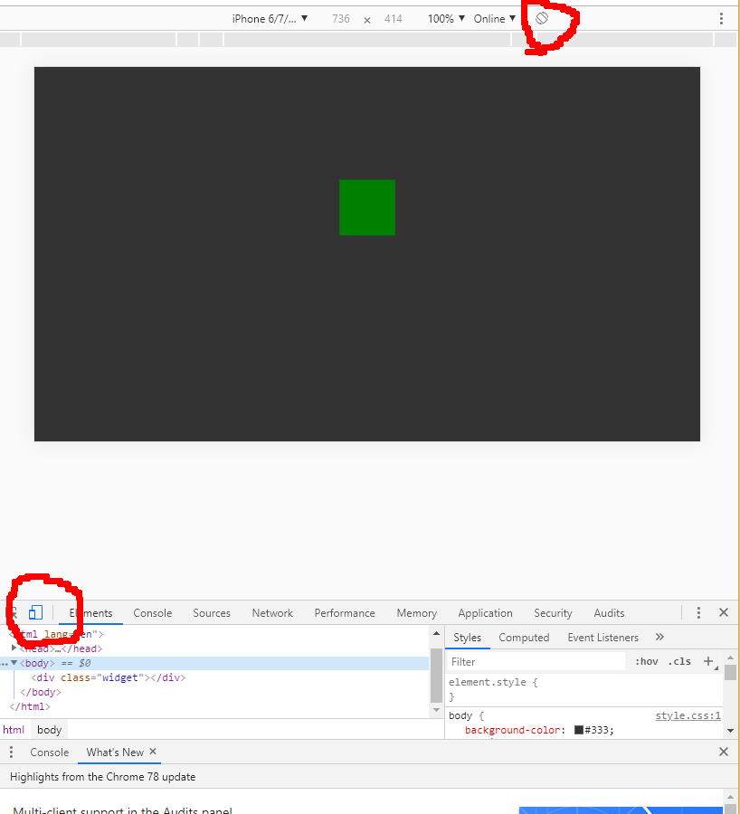

### Правильный выбор единиц измерения

> Пример посвящем CSS : vh,vw,vmin,vmax

* Для начала проштудируйте эти 4 единицы
* Скажем у вас есть такой стартовый код [html](index.html) и [css](style.css) запустите его в браузере и проверьте в двух режимах когда окно браузера принимает ["альбомный"](album.png) формат и потом когда ["портретный"](portrait.png) формат, как буд-то вы переворачиваете телефон на 90 градусов. Этот тест еще в Chrome можно сделать так:
  * нажать F12 и выбрать иконку "devices" там нарисован обычно планшет / телефон как на картинке 
  * С иконки переворота девайса переключатся между двумя положениями
* Обратите внимание что при этом ваш основной виджет (квадрат) меняет свой размер

---
* Требуется:
  1. Ответить на вопрос - почему его размер меняется?
  2. Выбрать вместо **vh** такую единицу измерения из тех 4-х, чтобы изначально (в альбомном) он был такого же размера как с **vh** и сохранял бы размер при перевороте на 90 градусов
